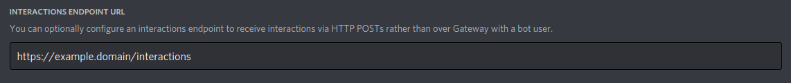

# dispike

***
[](https://codecov.io/gh/ms7m/dispike)   

***


an *extremely-extremely* early WIP library for easily creating REST-based webhook bots for discord using the new Slash Commands feature. 

Powered by FastAPI.


## Example (a simple bot)

```python

# Incoming models use this.
from dispike.models.incoming import IncomingDiscordInteraction # For Type Hinting

# Main Dispike Object
from dispike import Dispike

# For creating commands.
from dispike.register.models import DiscordCommand, CommandOption, CommandChoice, CommandTypes

# For responding to commands.
from dispike.response import DiscordResponse


bot = Dispike(
  client_public_key="< PublicKey >"
  bot_token="< Bot Token >",
  application_id="< AppID >"
)


# Let's register a command.
# /wave <person>
# Learn more about registering commands in the Discord Docs.

command_to_be_created = DiscordCommand(
    name="wave" # this is the main command name.,
    description="Send a wave to a nice person! 👋 ",
    options=[
        CommandOption(
            name="person" # this is the attribute assigned to the value passed.,
            description="person to target" # this describes the value to pass,
          	required=True,
            type=CommandTypes.USER
        )
    ]
)

# Nice, we created a command. /wave <person to ping>. Let's register it.

bot.register(
	command_to_be_created
)


# We've registered, now it's time to build the bot! 
# Arguments that you pass to your function are 
# the same arguments you defined/registered with discord..
# Don't forget to have an argument for a ctx (context). 

@bot.interaction.on("wave")
async def handle_send_wave(person: int, ctx: IncomingDiscordInteraction):
  logger.info("Recieved a wave!")
  

  # this is what we will be returning. Let's edit it.
  # Discord will pass the user id..
  _response = DiscordResponse()
  _response.content f"👋 Hi @<{person}>."
  
  return _response.response
  
# Run your bot.
# Powered by uvicorn.

bot.run(port=5000)
    
```
Embeds are also available (Copied from Discord.py)

```python
from dispike.helper import Embed

_response = DiscordResponse()
_response.embed = Embed() # your embed created.
```

## Getting, Deleting and Editing Commands


```python
from dispike import Dispike

# For creating commands.
from dispike.register.models import DiscordCommand, CommandOption, CommandChoice, CommandTypes


bot = Dispike(
	client_public_key="< PublicKey >"
  bot_token="< Bot Token >",
  application_id="< AppID >"
)

all_commands = bot.get_commands()

for command in all_commands:
  print(f"{command.name} -> {command.id}")
 
target_command = all_commands[0]

command_to_be_created = DiscordCommand(
    name="salute" # this is the main command name.,
    description="Send a salute to a nice person! ",
    options=[
        CommandOption(
            name="person" # this is the attribute assigned to the value passed.,
            description="person to target" # this describes the value to pass,
          	required=True,
            type=CommandTypes.USER
        )
    ]
)

bot.edit_command(target_command.id, command_to_be_created)
bot.delete_command(all_commands[1].id)
```


When configuring your endpoint on discord settings, be sure to append ``/interactions`` to your domain.

<p >
    
</p>

## Caveats

- ~~Does not handle registring new commands.~~
- ~~Does not handle anything other then string responses. (However you are free to return any valid dict in your handler.)~~
- ~~Not on PyPi~~
- Does not speak over the discord gateway. You'll need a server to handle requests and responses.
- Python 3.6+
- Does not support the following endpoints
  - [Create Followup Message](https://discord.com/developers/docs/interactions/slash-commands#create-followup-message)
  - [Edit Followup Message](https://discord.com/developers/docs/interactions/slash-commands#edit-followup-message)
  - [Delete Followup Message](https://discord.com/developers/docs/interactions/slash-commands#delete-followup-message)
- Handling followup messages.


# Development

Help is wanted in mantaining this library. Please try to direct PRs to the ``dev`` branch, and use black formatting (if possible).


